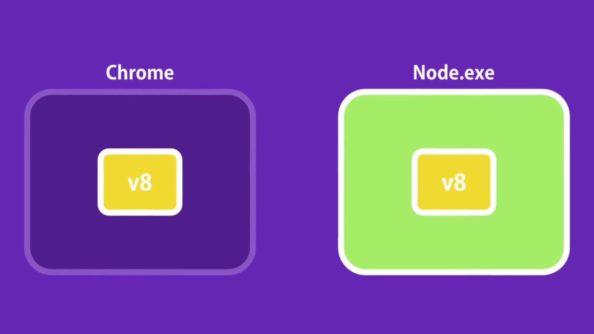
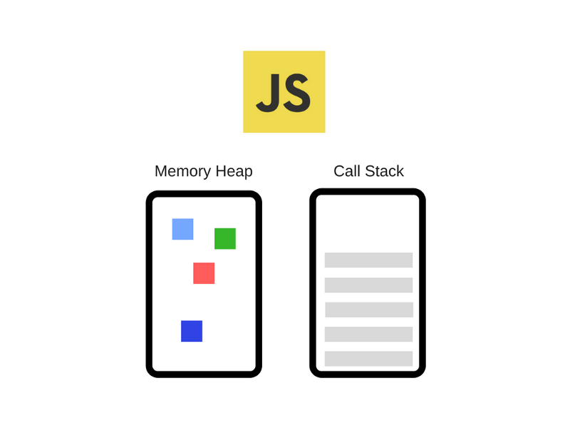

# Javascript Runtime và Javascript Engine

Chào mừng các bạn đến với series Javascript nâng cao.

Trong bài viết đầu tiên này mình sẽ giới thiệu về các thành phần quan trọng nhất để giúp Javascript có thể hoạt động và chạy trên môi trường trình duyệt hoặc chạy môi trường server.

## Javascript Runtime

Javascript Runtime là môi trường Javascript thực thi như Browser và Server (hay nói cách khác là môi trường Node JS). Ở môi trường Server sẽ có một số thành phần khác một chút so với môi trường Browser. Vì vậy, trong bài viết này, mình sẽ tìm hiểu ở môi trường Browser thôi nhé.

Đối với môi trường Browser, nó có khoảng 4 thành phần chính để giúp Javascript có thể chạy được, cũng như xử lý được các tác vụ bất đồng bộ bao gồm: Javascript Engine, Web APIs, Callback Queues và Event Loop.

Trong đó, thành phần quan trọng nhất là Javascript Engine. Ba thành phần còn lại hỗ trợ cho Javascript có thể tương tác, quản lý các tác vụ bất đồng bộ.

## Javascript Engine

Hiểu đơn giản JS Engine là một chương trình hoặc trình thông dịch để thực thi code JS. Bên trong JS Engine sẽ gồm 2 phần chính gồm Memory Heap và Call stack như hình bên dưới

#### Memory Heap

Memory Heap hay còn gọi là bộ nhớ Heap. Không chỉ trong JS mà trong ngành lập trình nói chung. Bộ nhớ heap dùng để cấp phát bộ nhớ mà không bị giới hạn. Cụ thể là trong JS, bạn có thể thoải mái khai báo biến, hàm thoải mái mà không cần phải khai báo kiểu dữ liệu. Bản thân JS là ngôn ngữ lập trình bậc cao nên đã được xây dựng sẵn các phần cấp phát bộ nhớ và tự động thu hồi, dọn dẹp những bộ nhớ mà chúng ta không dùng đến. Khác hoàn toàn so với ngôn ngữ như C, C++, khi lập trình, bạn phải tự cấp phát vùng nhớ và thu hồi vùng nhớ đó. Nói tóm lại, khi khai báo biến, hàm thì tất cả được lưu trữ tại đây.

#### Call stack

Call stack hay còn gọi là hàng đợi thực thi. Tại một thời điểm, hàm nào được thực thi thì hàm đó sẽ được đẩy vào call stack. Khi hàm đó thực thi trong nó sẽ remove ra khỏi call stack (Thuật ngữ remove gọi là pop. Pop một phần tử ra khỏi đỉnh call stack).

Ngoài ra, Call Stack chỉ xử lý được các tác vụ đồng bộ trong JS vì bản thân JS là ngôn ngữ Single Thread nên không thể thực thi song song cùng 1 lúc 2 tác vụ. Vì thế, để xử lý được các tác vụ bất đồng bộ thì cần phải nhờ sự hỗ trợ của Event Loop, Callback Queues.

## Lời kết

Qua bài viết này, mình đã giới thiệu tổng quan về các thành phần chính để JS có thể chạy được. Cụ thể là trong môi trường Browser. Ở bài viết sau, mình sẽ cùng đi tìm hiểu về ngữ cảnh thực thi (Execution Context) trong Javascript.
